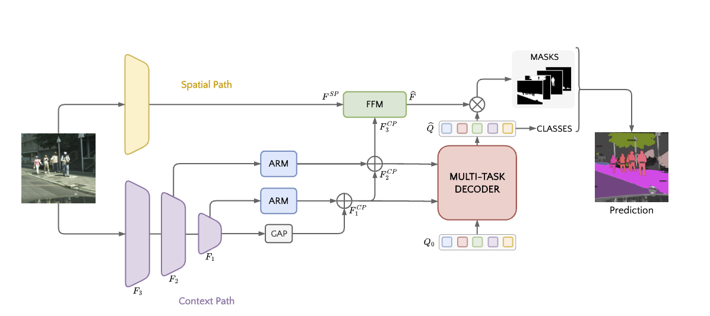

# BisenetFormer

## Overview

[BisenetFormer](https://arxiv.org/abs/2404.09570) is an advanced segmentation model that combines the efficiency of BiSeNet (Bilateral Segmentation Network) with the power of transformer architectures. Developed by FocoosAI, this model is designed for real-time semantic segmentation tasks requiring both high accuracy and computational efficiency.

The model employs a dual-path architecture where spatial details are preserved through one path while semantic information is processed through another, then fused with transformer-based attention mechanisms for superior segmentation performance.

## Neural Network Architecture


The BisenetFormer architecture consists of four main components working in concert:

### Backbone
- **Purpose**: Feature extraction from input images
- **Design**: Configurable backbone network (e.g., ResNet, STDC)
- **Output**: Multi-scale features at different resolutions (1/4, 1/8, 1/16, 1/32)

### Context Path
- **Component**: Global context extraction path
- **Features**:
  - Attention Refinement Module (ARM) for feature enhancement
  - Global Average Pooling for context aggregation
  - Multi-scale feature fusion with upsampling
- **Purpose**: Captures high-level semantic information

### Spatial Path (Detail Branch)
- **Component**: Spatial detail preservation path
- **Features**:
  - Bilateral structure maintaining spatial resolution
  - ConvBNReLU blocks for efficient processing
  - Feature Fusion Module (FFM) for combining paths
- **Purpose**: Preserves fine-grained spatial details

### Transformer Decoder
- **Design**: Lightweight transformer decoder with attention mechanisms
- **Components**:
  - Self-attention layers for feature refinement
  - Cross-attention layers for multi-scale feature integration
  - Feed-forward networks (FFN) for feature transformation
  - 100 learnable object queries (configurable)
- **Layers**: Configurable number of decoder layers (default: 6)

## Configuration Parameters

### Core Model Parameters
- `num_classes` (int): Number of segmentation classes
- `num_queries` (int, default=100): Number of learnable object queries
- `backbone_config` (BackboneConfig): Backbone network configuration

### Architecture Dimensions
- `pixel_decoder_out_dim` (int, default=256): Pixel decoder output channels
- `pixel_decoder_feat_dim` (int, default=256): Pixel decoder feature channels
- `transformer_predictor_hidden_dim` (int, default=256): Transformer hidden dimension
- `transformer_predictor_dec_layers` (int, default=6): Number of decoder layers
- `transformer_predictor_dim_feedforward` (int, default=1024): FFN dimension
- `head_out_dim` (int, default=256): Prediction head output dimension

### Inference Configuration
- `postprocessing_type` (str): Either "semantic" or "instance" segmentation
- `mask_threshold` (float, default=0.5): Binary mask threshold
- `threshold` (float, default=0.5): Confidence threshold for detections
- `top_k` (int, default=300): Maximum number of detections to return
- `use_mask_score` (bool, default=False): Whether to use mask quality scores
- `predict_all_pixels` (bool, default=False): Predict class for every pixel, usually better for semantic segmentation

## Losses

The model employs three complementary loss functions as described in the [Mask2Former paper](https://arxiv.org/abs/2112.01527):

1. **Cross-entropy Loss (`loss_ce`)**: Classification of object classes
2. **Dice Loss (`loss_dice`)**: Shape-aware segmentation loss
3. **Mask Loss (`loss_mask`)**: Binary cross-entropy on predicted masks


## Supported Tasks

### Semantic Segmentation
- **Output**: Dense pixel-wise class predictions
- **Use Cases**: Scene understanding, autonomous driving, medical imaging
- **Configuration**: Set `postprocessing_type="semantic"`

### Instance Segmentation
- **Output**: Individual object instances with masks and bounding boxes
- **Use Cases**: Object detection and counting, robotics applications
- **Configuration**: Set `postprocessing_type="instance"`

## Model Outputs

### Internal Output (`BisenetFormerOutput`)
- `masks` (torch.Tensor): Shape [B, num_queries, H, W] - Query mask predictions
- `logits` (torch.Tensor): Shape [B, num_queries, num_classes] - Class predictions
- `loss` (Optional[dict]): Training losses including:
    - `loss_ce`: Cross-entropy classification loss
    - `loss_mask`: Binary cross-entropy mask loss
    - `loss_dice`: Dice coefficient loss

### Inference Output (`FocoosDetections`)
For each detected object:

- `bbox` (List[float]): Bounding box coordinates [x1, y1, x2, y2]
- `conf` (float): Confidence score
- `cls_id` (int): Class identifier
- `mask` (str): Base64-encoded binary mask
- `label` (Optional[str]): Human-readable class name


## Available Models

Currently, you can find 3 bisenetformer models on the Focoos Hub, all for the semantic segmentation task.

| Model Name | Architecture | Dataset | Metric | FPS Nvidia-T4 |
|------------|--------------|----------|---------|--------------|
| bisenetformer-l-ade | BisenetFormer (STDC-2) | ADE20K | mIoU: 45.07<br>mAcc: 58.03 | - |
| bisenetformer-m-ade | BisenetFormer (STDC-2) | ADE20K | mIoU: 43.43<br>mACC: 57.01 | - |
| bisenetformer-s-ade | BisenetFormer (STDC-1) | ADE20K | mIoU: 42.91<br>mACC: 56.55 | - |


## Example Usage

### Quick Start with Pre-trained Model

```python
from focoos import ASSETS_DIR, ModelManager
from PIL import Image

# Load a pre-trained BisenetFormer model
model = ModelManager.get("bisenetformer-m-ade")

# Run inference on an image
image = ASSETS_DIR / "ADE_val_00000034"
result = model.infer(image, threshold=0.5, annotate=True)

# Process results
for detection in result.detections:
    print(f"Class: {detection.label}, Confidence: {detection.conf:.3f}")
# Visualize image
Image.fromarray(result.image)
```

### Custom Model Configuration

```python
from focoos.models.bisenetformer.config import BisenetFormerConfig
from focoos.models.bisenetformer.modelling import BisenetFormer
from focoos.nn.backbone.stdc import STDCConfig

# Configure the backbone
backbone_config = STDCConfig(
    model_type="stdc",
    use_pretrained=True,
)

# Configure the BisenetFormer model
config = BisenetFormerConfig(
    backbone_config=backbone_config,
    num_classes=150,  # ADE20K classes
    num_queries=100,
    postprocessing_type="semantic",
    predict_all_pixels=True,  # Better for semantic segmentation
    transformer_predictor_dec_layers=6,
    threshold=0.5,
)

# Create the model
model = BisenetFormer(config)
```
